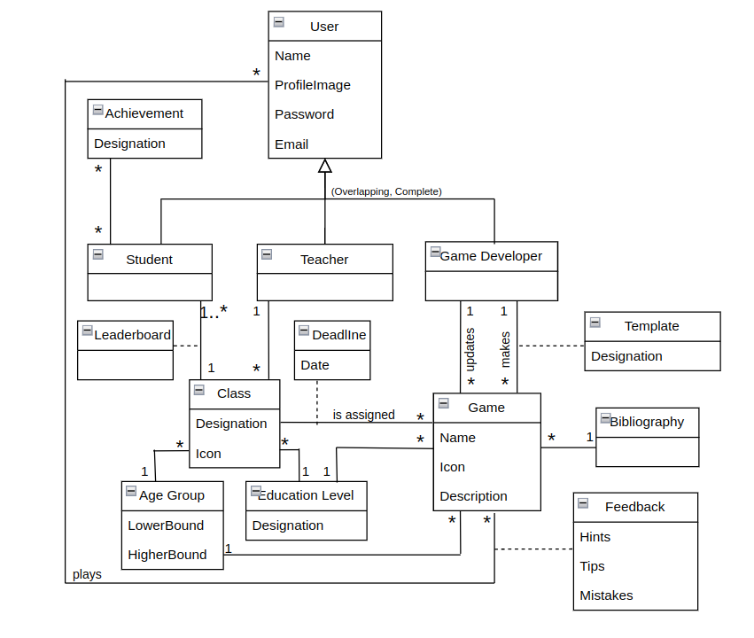

# LearnVironment Development Report

Welcome to the documentation pages of LearnVironment!

This Software Development Report, tailored for LEIC-ES-2024-25, provides comprehensive details about LearnVironment, from high-level vision to low-level implementation decisions. It’s organised by the following activities. 

* [Business modeling](#Business-Modelling) 
  * [Product Vision](#Product-Vision)
  * [Features and Assumptions](#Features-and-Assumptions)
  * [Elevator Pitch](#Elevator-pitch)
* [Requirements](#Requirements)
  * [User stories](#User-stories)
  * [Domain model](#Domain-model)
* [Architecture and Design](#Architecture-And-Design)
  * [Logical architecture](#Logical-Architecture)
  * [Physical architecture](#Physical-Architecture)
  * [Vertical prototype](#Vertical-Prototype)
* [Project management](#Project-Management)
  * [Sprint 0](#Sprint-0)
  * [Sprint 1](#Sprint-1)
  * [Sprint 2](#Sprint-2)
  * [Sprint 3](#Sprint-3)
  * [Sprint 4](#Sprint-4)
  * [Final Release](#Final-Release)

Contributions are expected to be made exclusively by the initial team, but we may open them to the community, after the course, in all areas and topics: requirements, technologies, development, experimentation, testing, etc.

Please contact us!

Thank you!

* Henrique Vilarinho [up202307037@up.pt](mailto:up202307037@up.pt)
* Leonor Bidarra [up202307719@up.pt](mailto:up202307719@up.pt)
* Maria Sousa [up202303834@up.pt](mailto:up202303834@up.pt)
* Tomás Morais [up202304692@up.pt](mailto:up202304692@up.pt)

---
## Business Modelling

Business modeling in software development involves defining the product's vision, understanding market needs, aligning features with user expectations, and setting the groundwork for strategic planning and execution.

### Product Vision

What if there was an app that gamified learning and teaching about recycling?
Our app LearnVironment provides a learning environment in a fun and ludic way.

<!-- 
Start by defining a clear and concise vision for your app, to help members of the team, contributors, and users into focusing their often disparate views into a concise, visual, and short textual form. 

The vision should provide a "high concept" of the product for marketers, developers, and managers.

A product vision describes the essential of the product and sets the direction to where a product is headed, and what the product will deliver in the future. 

**We favor a catchy and concise statement, ideally one sentence.**

We suggest you use the product vision template described in the following link:
* [How To Create A Convincing Product Vision To Guide Your Team, by uxstudioteam.com](https://uxstudioteam.com/ux-blog/product-vision/)

To learn more about how to write a good product vision, please see:
* [Vision, by scrumbook.org](http://scrumbook.org/value-stream/vision.html)
* [Product Management: Product Vision, by ProductPlan](https://www.productplan.com/glossary/product-vision/)
* [How to write a vision, by dummies.com](https://www.dummies.com/business/marketing/branding/how-to-write-vision-and-mission-statements-for-your-brand/)
* [20 Inspiring Vision Statement Examples (2019 Updated), by lifehack.org](https://www.lifehack.org/articles/work/20-sample-vision-statement-for-the-new-startup.html)
-->

### Features and Assumptions
#### High-Level Features:
- **Student Profiles & Progress Tracking** - Students can create and customize their profiles, view their progress, including games played, mistakes made, and learning outcomes.  
- **Classroom Management** - Teachers can create and manage multiple classes, assign students to specific classes, choose what games are available for that class and monitor individual student and class performance.
- **Game Exploration** - Any user can browse and play a variety of educational games, categorized by age and educational level, to enhance their learning. This allows teachers and developers to test the games before students play them and students autonomously play any game in the platform.
- **Game Content Overview and Verification** - Teachers can review the educational objectives and bibliographies associated with each game to ensure the accuracy and credibility of the content. Games may also have a verified tag stating that the app developers ensured it's accuracy.
- **Game Development Platform** - Game developers can create, edit, and update their educational games within the app. They must provide and adviced age group and write an appropriate description and corresponding bibliography for each game.
- **Real-Time Feedback** - The games will provide instant feedback during gameplay, highlighting mistakes, rewarding progress, and offering hints or tips.
- **Leaderboard** - The teacher will be able to turn on a leaderboard for each of his classes to encourage students to play the educative games.
- **Achievement System** - The student will receive achivements based on performance which will be available on the students profile to encourage him to learn more.
- **Notifications** - The app will send reminders to students about upcoming game deadlines.

#### Assumptions and Dependencies:
- **User Roles** - The app will have three distinct user roles: Student, Teacher, and Game Developer, each with different levels of capabilities.
- **Firebase** - The app will be dependent on Firebase servers.
<!-- 
Indicate an  initial/tentative list of high-level features - high-level capabilities or desired services of the system that are necessary to deliver benefits to the users.
 - Feature XPTO - a few words to briefly describe the feature
 - Feature ABCD - ...
...

Optionally, indicate an initial/tentative list of assumptions that you are doing about the app and dependencies of the app to other systems.
-->

### Elevator Pitch
Have you ever wondered how to engage students in learning about sustainability in a fun and interactive way?  
Our app offers a unique platform for teachers to help students aged 6-16 learn recycling, citizenship and sustainability through engaging games. Teachers can create classes, assign personalized games, and track student progress with detailed performance stats. Unlike traditional methods, our app offers a dynamic learning experience with age-appropriate games, verified content, and a bibliography for each game that cites the sources of the information, ensuring accuracy and trustworthiness Start making sustainability education more enjoyable and impactful today with our app!

<!-- 
Draft a small text to help you quickly introduce and describe your product in a short time (lift travel time ~90 seconds) and a few words (~800 characters), a technique usually known as elevator pitch.

Take a look at the following links to learn some techniques:
* [Crafting an Elevator Pitch](https://www.mindtools.com/pages/article/elevator-pitch.htm)
* [The Best Elevator Pitch Examples, Templates, and Tactics - A Guide to Writing an Unforgettable Elevator Speech, by strategypeak.com](https://strategypeak.com/elevator-pitch-examples/)
* [Top 7 Killer Elevator Pitch Examples, by toggl.com](https://blog.toggl.com/elevator-pitch-examples/)
-->

## Requirements

### User Stories
#### Most Important User Story
- As a student I want to be able to play any game and learn, even if it wasn’t assigned by my teacher.
   **Value:** Must-have
   **Effort:** 8
  

  ```gherkin
  Scenario: Play any game available on the app
	Given I am a student logged into the app
	When I navigate to the games section
	Then I should be able to select and play any game independently of it being assigned to me or not
  ```
#### Other User Stories
- As a student I want to be able to browse all games so that I can see what games I can play.
  ```gherkin
  Scenario: Browse all games  
	  Given I am a student logged into the app  
	  When I navigate to the games section
	  Then I should see a list of all available games  
  ```
- As an non registered user I want to be able to register so that I can use the app.
- As a student I want the games to provide instant feedback so that I know how I did.
- As a student I want the games to offer tips so that I can improve my learning.
- As a teacher I want to be able to create a class so that I can use the app with multiple classrooms of diferent age groups and needs.
- As a teacher I want to be able to assign students to classes so that I can divide my students between subjects and age groups.
- As a teacher I want to be able to assign games to a class so that students know what to play.
- As a teacher I want to be able to remove students from classes so that I can regulate drop-outs.
- As a student I want to be able to easily join my teachers class so that I can start learning fast.
- As a student I want to be able to view my mistakes so that I can easily revise those materials.  
- As a student I want to be able to view the games I have played so that I can keep track of my progress.  
- As a teacher I want to be able to monitor individual student so that I can see the progress of individuals.
- As a teacher I want to be able to monitor class performance so that I can see the progress of the overall class.
- As a user I want to be able to customize my profile so that I can be easily identified.
- As a game developer I want to be able to browse all games so that I can see what other developers have made and inovate.
- As a game developer I want to be able to create a game so that others could play it.
- As a game developer I want to be able to edit my game so that I can fix bugs.
- As a game developer I want to be able to dry run my game so that I can ensure it is bug-free.
- As a user I want to have a bibliography associated with each game so that I can easily verify the accuracy and sources of the information.
- As a teacher I want to be able to play a game before I assign them to my students so that I can ensure the games are appropriate and accurate.
- As a game developer I want to be able to add a description to my game so that users can understand what it is about before playing it.
- As a game developer I want to be able to associate a game with an age group so that my games reach their target audience.
- As a student I want to receive notifications if a game I was assigned to play has a close deadline so that I don't miss my assignments due date.
- As a teacher I want to have an option to enable a classroom leaderboard so that I can motivate my students to engage with the educational games.
- As a student I want to receive achivements based on performance and display them on my profile so that I can showcase my progress.

<!-- 
In this section, you should describe all kinds of requirements for your module: functional and non-functional requirements.

For LEIC-ES-2024-25, the requirements will be gathered and documented as user stories. 

Please add in this section a concise summary of all the user stories.

**User stories as GitHub Project Items**
The user stories themselves should be created and described as items in your GitHub Project with the label "user story". 

A user story is a description of a desired functionality told from the perspective of the user or customer. A starting template for the description of a user story is *As a < user role >, I want < goal > so that < reason >.*

Name the item with either the full user story or a shorter name. In the “comments” field, add relevant notes, mockup images, and acceptance test scenarios, linking to the acceptance test in Gherkin when available, and finally estimate value and effort.

**INVEST in good user stories**. 
You may add more details after, but the shorter and complete, the better. In order to decide if the user story is good, please follow the [INVEST guidelines](https://xp123.com/articles/invest-in-good-stories-and-smart-tasks/).

**User interface mockups**.
After the user story text, you should add a draft of the corresponding user interfaces, a simple mockup or draft, if applicable.

**Acceptance tests**.
For each user story you should write also the acceptance tests (textually in [Gherkin](https://cucumber.io/docs/gherkin/reference/)), i.e., a description of scenarios (situations) that will help to confirm that the system satisfies the requirements addressed by the user story.

**Value and effort**.
At the end, it is good to add a rough indication of the value of the user story to the customers (e.g. [MoSCoW](https://en.wikipedia.org/wiki/MoSCoW_method) method) and the team should add an estimation of the effort to implement it, for example, using points in a kind-of-a Fibonnacci scale (1,2,3,5,8,13,20,40, no idea).

-->

### Domain model




<!-- 
To better understand the context of the software system, it is useful to have a simple UML class diagram with all and only the key concepts (names, attributes) and relationships involved of the problem domain addressed by your app. 
Also provide a short textual description of each concept (domain class). 

Example:
 <p align="center" justify="center">
  
</p>
-->


## Architecture and Design
<!--
The architecture of a software system encompasses the set of key decisions about its organization. 

A well written architecture document is brief and reduces the amount of time it takes new programmers to a project to understand the code to feel able to make modifications and enhancements.

To document the architecture requires describing the decomposition of the system in their parts (high-level components) and the key behaviors and collaborations between them. 

In this section you should start by briefly describing the components of the project and their interrelations. You should describe how you solved typical problems you may have encountered, pointing to well-known architectural and design patterns, if applicable.
-->


### Logical architecture


<!--
The purpose of this subsection is to document the high-level logical structure of the code (Logical View), using a UML diagram with logical packages, without the worry of allocating to components, processes or machines.

It can be beneficial to present the system in a horizontal decomposition, defining layers and implementation concepts, such as the user interface, business logic and concepts.

Example of _UML package diagram_ showing a _logical view_ of the Eletronic Ticketing System (to be accompanied by a short description of each package):


-->


### Physical architecture

The representation of our app’s physical architecture features the following entities. The User’s Device, through which they interact with the Flutter app. The Cloud-Based Backend (Firebase Server) contains all the Firebase services essential for the app’s functionalities, as well as the Firebase Database, which stores all the information produced and required by the users.


Regarding technologies, for the frontend, we used Flutter, with the Dart programming language and, for the backend, Firebase.
<!--
The goal of this subsection is to document the high-level physical structure of the software system (machines, connections, software components installed, and their dependencies) using UML deployment diagrams (Deployment View) or component diagrams (Implementation View), separate or integrated, showing the physical structure of the system.

It should describe also the technologies considered and justify the selections made. Examples of technologies relevant for ESOF are, for example, frameworks for mobile applications (such as Flutter).

Example of _UML deployment diagram_ showing a _deployment view_ of the Eletronic Ticketing System (please notice that, instead of software components, one should represent their physical/executable manifestations for deployment, called artifacts in UML; the diagram should be accompanied by a short description of each node and artifact):


-->


### Vertical prototype
<!--
To help on validating all the architectural, design and technological decisions made, we usually implement a vertical prototype, a thin vertical slice of the system integrating as much technologies we can.

In this subsection please describe which feature, or part of it, you have implemented, and how, together with a snapshot of the user interface, if applicable.

At this phase, instead of a complete user story, you can simply implement a small part of a feature that demonstrates thay you can use the technology, for example, show a screen with the app credits (name and authors).
-->

## Project management
<!--
Software project management is the art and science of planning and leading software projects, in which software projects are planned, implemented, monitored and controlled.

In the context of ESOF, we recommend each team to adopt a set of project management practices and tools capable of registering tasks, assigning tasks to team members, adding estimations to tasks, monitor tasks progress, and therefore being able to track their projects.

Common practices of managing agile software development with Scrum are: backlog management, release management, estimation, Sprint planning, Sprint development, acceptance tests, and Sprint retrospectives.

You can find below information and references related with the project management: 

* Backlog management: Product backlog and Sprint backlog in a [Github Projects board](https://github.com/orgs/FEUP-LEIC-ES-2023-24/projects/64);
* Release management: [v0](#), v1, v2, v3, ...;
* Sprint planning and retrospectives: 
  * plans: screenshots of Github Projects board at begin and end of each Sprint;
  * retrospectives: meeting notes in a document in the repository, addressing the following questions:
    * Did well: things we did well and should continue;
    * Do differently: things we should do differently and how;
    * Puzzles: things we don’t know yet if they are right or wrong… 
    * list of a few improvements to implement next Sprint;

-->

### Sprint 0

### Sprint 1

### Sprint 2

### Sprint 3

### Sprint 4

### Final Release
