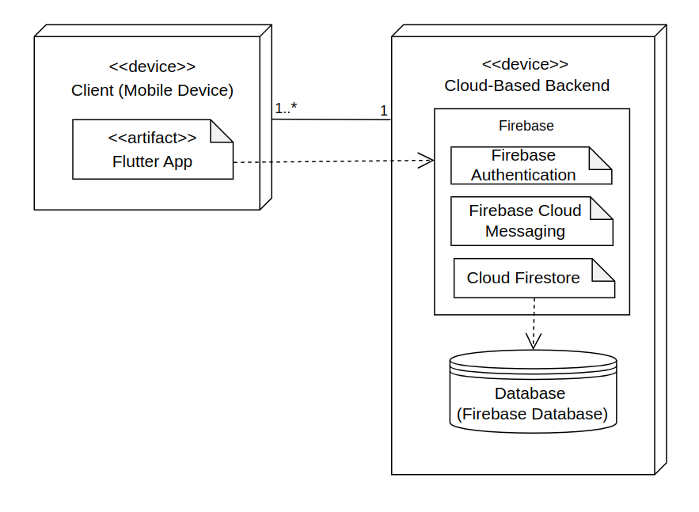

# LearnVironment Development Report

Welcome to the documentation pages of LearnVironment!

This Software Development Report, tailored for LEIC-ES-2024-25, provides comprehensive details about LearnVironment, from high-level vision to low-level implementation decisions. It’s organised by the following activities. 

* [Business modeling](#Business-Modelling) 
  * [Product Vision](#Product-Vision)
  * [Features and Assumptions](#Features-and-Assumptions)
  * [Elevator Pitch](#Elevator-pitch)
* [Requirements](#Requirements)
  * [User stories](#User-stories)
  * [Domain model](#Domain-model)
* [Architecture and Design](#Architecture-And-Design)
  * [Logical architecture](#Logical-Architecture)
  * [Physical architecture](#Physical-Architecture)
  * [Vertical prototype](#Vertical-Prototype)
* [Project management](#Project-Management)
  * [Sprint 0](#Sprint-0)
  * [Sprint 1](#Sprint-1)
  * [Sprint 2](#Sprint-2)
  * [Sprint 3](#Sprint-3)
  * [Sprint 4](#Sprint-4)
  * [Final Release](#Final-Release)

Contributions are expected to be made exclusively by the initial team, but we may open them to the community, after the course, in all areas and topics: requirements, technologies, development, experimentation, testing, etc.

Please contact us!

Thank you!

* Henrique Vilarinho [up202307037@up.pt](mailto:up202307037@up.pt)
* Leonor Bidarra [up202307719@up.pt](mailto:up202307719@up.pt)                  
* Maria Sousa [up202303834@up.pt](mailto:up202303834@up.pt)
* Miguel Roque [up202304950@up.pt](mailto:up202304950@up.pt)
* Tomás Morais [up202304692@up.pt](mailto:up202304692@up.pt)

---
## Business Modelling

Business modeling in software development involves defining the product's vision, understanding market needs, aligning features with user expectations, and setting the groundwork for strategic planning and execution.

### Product Vision

What if there was an app that gamified learning and teaching about recycling and sustentability?
Our app LearnVironment provides a learning environment in a fun and ludic way.

<!-- 
Start by defining a clear and concise vision for your app, to help members of the team, contributors, and users into focusing their often disparate views into a concise, visual, and short textual form. 

The vision should provide a "high concept" of the product for marketers, developers, and managers.

A product vision describes the essential of the product and sets the direction to where a product is headed, and what the product will deliver in the future. 

**We favor a catchy and concise statement, ideally one sentence.**

We suggest you use the product vision template described in the following link:
* [How To Create A Convincing Product Vision To Guide Your Team, by uxstudioteam.com](https://uxstudioteam.com/ux-blog/product-vision/)

To learn more about how to write a good product vision, please see:
* [Vision, by scrumbook.org](http://scrumbook.org/value-stream/vision.html)
* [Product Management: Product Vision, by ProductPlan](https://www.productplan.com/glossary/product-vision/)
* [How to write a vision, by dummies.com](https://www.dummies.com/business/marketing/branding/how-to-write-vision-and-mission-statements-for-your-brand/)
* [20 Inspiring Vision Statement Examples (2019 Updated), by lifehack.org](https://www.lifehack.org/articles/work/20-sample-vision-statement-for-the-new-startup.html)
-->

### Features and Assumptions
#### High-Level Features:
- **Student Profiles & Progress Tracking** - Students can create and customize their profiles, view their progress, including games played, mistakes made, and learning outcomes.  
- **Classroom Management** - Teachers can create and manage multiple classes, assign students to specific classes, choose what games are available for that class and monitor individual student and class performance.
- **Game Exploration** - Any user can browse and play a variety of educational games, categorized by age and educational level, to enhance their learning. This allows teachers and developers to test the games before students play them and students autonomously play any game in the platform.
- **Game Content Overview and Verification** - Teachers can review the educational objectives and bibliographies associated with each game to ensure the accuracy and credibility of the content. Games may also have a verified tag stating that the app developers ensured it's accuracy.
- **Game Development Platform** - Game developers can create, edit, and update their educational games within the app. They must provide and adviced age group and write an appropriate description and corresponding bibliography for each game.
- **Real-Time Feedback** - The games will provide instant feedback during gameplay, highlighting mistakes, rewarding progress, and offering hints or tips.
- **Leaderboard** - The teacher will be able to turn on a leaderboard for each of his classes to encourage students to play the educative games.
- **Achievement System** - The student will receive achivements based on performance which will be available on the students profile to encourage him to learn more.
- **Notifications** - The app will send reminders to students about upcoming game deadlines.

#### Assumptions and Dependencies:
- **User Roles** - The app will have three distinct user roles: Student, Teacher, and Game Developer, each with different levels of capabilities.
- **Firebase** - The app will be dependent on Firebase servers.
<!-- 
Indicate an  initial/tentative list of high-level features - high-level capabilities or desired services of the system that are necessary to deliver benefits to the users.
 - Feature XPTO - a few words to briefly describe the feature
 - Feature ABCD - ...
...

Optionally, indicate an initial/tentative list of assumptions that you are doing about the app and dependencies of the app to other systems.
-->

### Elevator Pitch
Have you ever wondered how to engage students in learning about sustainability in a fun and interactive way?  
Our app offers a unique platform for teachers to help students aged 6-16 learn recycling, citizenship and sustainability through engaging games. Teachers can create classes, assign personalized games, and track student progress with detailed performance stats. Unlike traditional methods, our app offers a dynamic learning experience with age-appropriate games, verified content, and a bibliography for each game that cites the sources of the information, ensuring accuracy and trustworthiness Start making sustainability education more enjoyable and impactful today with our app!

<!-- 
Draft a small text to help you quickly introduce and describe your product in a short time (lift travel time ~90 seconds) and a few words (~800 characters), a technique usually known as elevator pitch.

Take a look at the following links to learn some techniques:
* [Crafting an Elevator Pitch](https://www.mindtools.com/pages/article/elevator-pitch.htm)
* [The Best Elevator Pitch Examples, Templates, and Tactics - A Guide to Writing an Unforgettable Elevator Speech, by strategypeak.com](https://strategypeak.com/elevator-pitch-examples/)
* [Top 7 Killer Elevator Pitch Examples, by toggl.com](https://blog.toggl.com/elevator-pitch-examples/)
-->

## Requirements

### User Stories
#### Most Important User Story
- As a student I want to be able to play any game and learn, even if it wasn’t assigned by my teacher.  
   **Value:** Must-have  
   **Effort:** 8  
    


  ```gherkin
  Scenario: Play any game available on the app
	Given I am a student logged into the app
	When I navigate to the games section
	Then I should be able to select and play any game independently of it being assigned to me or not
  ```
#### Description  
Our app offers an engaging, interactive recycling game platform designed to promote sustainability, recycling, and good citizenship among students. 

Users can log in as one of three roles: Student, Teacher, or Game Developer, each with their own set of features and benefits.
Students can join a class created by their teacher or explore a variety of educational games available within the app. They can track their progress by viewing their individual statistics, including what they’ve learned, the games they've played, and their performance (mistakes made, etc.). The app allows for a personalized learning experience, ensuring each student can see their growth over time.
Teachers have the ability to create and manage multiple classes, adding as many students as needed. They can assign specific games to students and monitor their progress, including individual student statistics and overall class performance. Teachers can track which games have been played and verify student engagement. They also have the option to review the content of the games, including educational objectives and supporting verified materials (such as bibliographies and references), ensuring the accuracy and credibility of the information provided.
Game developers can create new educational games directly within the app. These developers have access to games they've created, with the ability to make edits and improvements as needed. The app provides a platform for developers to innovate and contribute new content, enhancing the learning experience for students and teachers alike.

Besides that, the app features pre-built educational games focused on sustainability, recycling, and citizenship. Each game includes detailed descriptions of its learning objectives, ensuring the educational material is accurate and credible. Games are rated by age group, making them suitable for students across a wide range of ages and educational levels.

<!-- 
In this section, you should describe all kinds of requirements for your module: functional and non-functional requirements.

For LEIC-ES-2024-25, the requirements will be gathered and documented as user stories. 

Please add in this section a concise summary of all the user stories.

**User stories as GitHub Project Items**
The user stories themselves should be created and described as items in your GitHub Project with the label "user story". 

A user story is a description of a desired functionality told from the perspective of the user or customer. A starting template for the description of a user story is *As a < user role >, I want < goal > so that < reason >.*

Name the item with either the full user story or a shorter name. In the “comments” field, add relevant notes, mockup images, and acceptance test scenarios, linking to the acceptance test in Gherkin when available, and finally estimate value and effort.

**INVEST in good user stories**. 
You may add more details after, but the shorter and complete, the better. In order to decide if the user story is good, please follow the [INVEST guidelines](https://xp123.com/articles/invest-in-good-stories-and-smart-tasks/).

**User interface mockups**.
After the user story text, you should add a draft of the corresponding user interfaces, a simple mockup or draft, if applicable.

**Acceptance tests**.
For each user story you should write also the acceptance tests (textually in [Gherkin](https://cucumber.io/docs/gherkin/reference/)), i.e., a description of scenarios (situations) that will help to confirm that the system satisfies the requirements addressed by the user story.

**Value and effort**.
At the end, it is good to add a rough indication of the value of the user story to the customers (e.g. [MoSCoW](https://en.wikipedia.org/wiki/MoSCoW_method) method) and the team should add an estimation of the effort to implement it, for example, using points in a kind-of-a Fibonnacci scale (1,2,3,5,8,13,20,40, no idea).

-->

### Domain model

- **User** - Generalization of the three different roles a user can assume. Stores information about the user.

- **Student, Teacher and Game Developer** - An user can assume at any time one of these three roles (the generalization is overlapping and complete), being limited to the actions associated with their current specific role.

- **Class** - Stores information about a class. A student can participate in many classes, each one managed by one teacher, who can manage multiple classes.

- **Leaderboard** - Represents the ranking of the students of a class based on their performance.

- **Achievement** - After meeting certain conditions, the user will be awarded with an achievement. There are many achievements which the user can obtain.

- **Game** - Stores information about a game. A game is made by one game developer, which can also update it. Games are assigned by teachers to the students of a class to play it. All published games are available for all users to play.

- **Template** - Each game has a certain template as its base, which the game developer customizes to create their one.

- **Bibliography** - Each game has a bibliography containing the information related to the game´s solution. The same bibliography can be used in various games.

- **Deadline** - When a teacher assigns a game to a class, they set a deadline for the students to complete the game.

- **Age Group and Education Level** - Each class has associated to it a certain age group and level of education for their students, as well as each game, in order to help teachers know what games to assign to a specific class and students which ones to play in order to practise.

- **Feedback** - After completing a game, it is shown to the student their score, what mistakes they made and tips for them to overcome their struggles.


<!-- 
To better understand the context of the software system, it is useful to have a simple UML class diagram with all and only the key concepts (names, attributes) and relationships involved of the problem domain addressed by your app. 
Also provide a short textual description of each concept (domain class). 

Example:
 <p align="center" justify="center">
  
</p>
-->


## Architecture and Design
<!--
The architecture of a software system encompasses the set of key decisions about its organization. 

A well written architecture document is brief and reduces the amount of time it takes new programmers to a project to understand the code to feel able to make modifications and enhancements.

To document the architecture requires describing the decomposition of the system in their parts (high-level components) and the key behaviors and collaborations between them. 

In this section you should start by briefly describing the components of the project and their interrelations. You should describe how you solved typical problems you may have encountered, pointing to well-known architectural and design patterns, if applicable.
-->


### Logical architecture

Regardin our app´s logical architecture, it follows a two-layered structure. User interacts with the app though the User Interface for actions and visual elements. The Business Logic handles the functionalities of the app, enabling communication with the Firebase Services which allows the storage and retrieval of data, user authentiaction and messaging.


<!--
The purpose of this subsection is to document the high-level logical structure of the code (Logical View), using a UML diagram with logical packages, without the worry of allocating to components, processes or machines.

It can be beneficial to present the system in a horizontal decomposition, defining layers and implementation concepts, such as the user interface, business logic and concepts.

Example of _UML package diagram_ showing a _logical view_ of the Eletronic Ticketing System (to be accompanied by a short description of each package):


-->


### Physical architecture

The representation of our app’s physical architecture features the following entities. The User’s Device, through which the user interacts with the Flutter app. The Cloud-Based Backend (Firebase Server) contains all the Firebase services essential for functioning of the app’s functionalities, such as Firebase Authentication, Firebase Cloud Messaging and Cloud Firestore, as well as the Firebase DataBase, which is accessed to store and retrive necessary data.




<!--
The goal of this subsection is to document the high-level physical structure of the software system (machines, connections, software components installed, and their dependencies) using UML deployment diagrams (Deployment View) or component diagrams (Implementation View), separate or integrated, showing the physical structure of the system.

It should describe also the technologies considered and justify the selections made. Examples of technologies relevant for ESOF are, for example, frameworks for mobile applications (such as Flutter).

Example of _UML deployment diagram_ showing a _deployment view_ of the Eletronic Ticketing System (please notice that, instead of software components, one should represent their physical/executable manifestations for deployment, called artifacts in UML; the diagram should be accompanied by a short description of each node and artifact):


-->


### Vertical prototype
<!--
To help on validating all the architectural, design and technological decisions made, we usually implement a vertical prototype, a thin vertical slice of the system integrating as much technologies we can.

In this subsection please describe which feature, or part of it, you have implemented, and how, together with a snapshot of the user interface, if applicable.

At this phase, instead of a complete user story, you can simply implement a small part of a feature that demonstrates thay you can use the technology, for example, show a screen with the app credits (name and authors).
-->
#### Sign-up and Sign-in
Our app uses Firebase Authentication to deal with the log in and sign-up of users,allowing them to easily create an account or sign in using their email address. During the sign-up phase, after entering their information, users will receive an email verification to confirm their identity.


#### Edit Profile
When a user is logged in, they can easily edit their profile. Users can upload a profile picture from their devices and the image gets stored locally. Besides the profile picture, users can also change their usernames and email addresses. These updates ensure their profile stays personalized and up to date.


#### Session Management
Our app keeps the information of the user's current session, ensuring that they do not have to continuously log in every time they reopen the app. This feature is very useful to maintain a good experience while using the app.

#### Account Deletion and Log Out
On the profile section of the app, users have the option to either log out or delete their accounts. Logging out ends the current session, sending them back to the log in page, and when the user chooses to delete their account, their data is removed from Firebase services.


#### Navigation and User Interface
We included basic navigation buttons that indicate and lead users to the different sections of the app. These buttons allow users to access the Statistics, Home and Games sections.


#### Unit Tests
To make sure our app's features worked properly, we have added unit and widget tests. The unit tests help verify that the functions and methods are working as intended, while the widget tests ensure the correct behaviour of UI elements, such as buttons. The usage of these tests ensure that the app is stable and reliable.


## Project management
<!--
Software project management is the art and science of planning and leading software projects, in which software projects are planned, implemented, monitored and controlled.

In the context of ESOF, we recommend each team to adopt a set of project management practices and tools capable of registering tasks, assigning tasks to team members, adding estimations to tasks, monitor tasks progress, and therefore being able to track their projects.

Common practices of managing agile software development with Scrum are: backlog management, release management, estimation, Sprint planning, Sprint development, acceptance tests, and Sprint retrospectives.

You can find below information and references related with the project management: 

* Backlog management: Product backlog and Sprint backlog in a [Github Projects board](https://github.com/orgs/FEUP-LEIC-ES-2023-24/projects/64);
* Release management: [v0](#), v1, v2, v3, ...;
* Sprint planning and retrospectives: 
  * plans: screenshots of Github Projects board at begin and end of each Sprint;
  * retrospectives: meeting notes in a document in the repository, addressing the following questions:
    * Did well: things we did well and should continue;
    * Do differently: things we should do differently and how;
    * Puzzles: things we don’t know yet if they are right or wrong… 
    * list of a few improvements to implement next Sprint;

-->

### Sprint 0

**Goal:** Create a simple Flutter app so the team becomes familiar with software development using Flutter; create team´s scrumboard as a Github Project; complete the documentation by inserting List of Features, UML Diagrams, User Stories, Acceptance Tests, and UI Mockups in the README.md file of our app; create a vertical prototype of our app, already including one of its features and implementing the Google Firebase Services that we intend to use

**Sprint Retrospective**

**Did Well:**

- **Effective Team Communication:** Our team members were able to create a productive work environment by continuously giving feedback about the progress of each one´s task, as well as promptly responding to questions related to technical issues, details about the app or the progress of the work;

- **Effective Work Balance and Distribution:** By adopting the strategy of dividing the tasks evenly among the team, the members managed to achieve a more cohesive and productive workflow, being able to concentrate on one task at a time and help the others on the execution of their tasks;

- **Holding Meetings:** In order to keep all team members on the same page regarding the progress of the app, they participated in a couple of meetings in order to establish the current state of the development and establish goals for the future, provide assistance to each member´s task and make decisions that would need the approval of the whole team;

- **Clear Definition of the App:** The team defined the app´s conceptual characteristics and core functionalities with success, being able to document everything in the README.md file of the project.


**Do Differently:** 

- **Participate in More Periodical Meetings:** With Sprint 1 starting and the team soon to begin the actual coding of our app´s functionalities, the members realize that more regular meetings will be necessary in order to ensure a productive and unobstructed work progress.


**Challenges:** 

- The successfull installation of Flutter and Android Studio in the members´ PCs;
  
- How to implement Google Firebase Services on our app.


**Board at the Beginning Of Sprint 0**


**Board at the End of Sprint 0**


### Sprint 1

**Goal:** Create an interface for users to browse all available games; develop a couple of games for users to play, specifically a quiz and a game where the player must choose the correct bin for different types of trash; integrate the games with Firebase Database and our app; implement a system within the games that allows users to view the mistakes they made during their playthrough; and allow users to register as a developer, teacher, or student and navigate the app according to their role.

**Sprint Retrospective:**

**Did Well:**

- **Regular Briefings and Team Support:** Team members consistently provided updates on their progress, reassuring others of the project's development and helping to resolve doubts or issues promptly to prevent delays.
  
- **Effective Work Balance and Distribution:** Tasks were assigned based on their complexity and estimated completion time, leading to a smoother workflow. No team member felt overwhelmed, and each task was handled appropriately according to its demands.

- **Holding More Meetings:** More in-person meetings were held between members working on the same tasks, creating a more collaborative environment and enabling faster completion of assignments.
  

**Do Differently:**

- **Revise Other Members Work Earlier:** Toward the end of the sprint, some members noticed issues in certain tasks that could have been identified and resolved earlier. Catching these problems sooner would have allowed for a calmer and higher-quality resolution.
  

**Challenges:**

- The implementation of unit and widget tests that required mocking Firebase;

**Board at the Beginning of Sprint 1**


**Board at the End of Sprint 1**


### Sprint 2

**Goal:** Create a way for teachers to have their classes; implement a way for teachers to add students to a class and create an assigment; allow users to register and edit their profile; fix bugs in app relative to back buttons, the game results page and add accessibility to the Bin game; allow students to receive notifications of their assignments. 

**Sprint Retrospective:**

**Did Well:**

- **Availability and Team Support:** Each member was always available to help others with their tasks, enabling faster implementation of features and a smoother workflow;

- **Implementation of the Most Difficult Features:** The team considers this sprint to have been its most ambitious one, not only because of the number of features it aimed to successfully implement, but also due to the complexity of some of them. Despite this, the team managed to successfully implement the majority of them.
  
  
**Do Differently:**

- **Do More Sooner:** Make as much progress as possible earlier in the sprint, in order to not have its conclusion compromised by external factors.
  

**Challenges:**

- The implementation of notifications using Firebase Cloud Messaging;

- The blackout that happened the day before the sprint deadline prevented us from making progress on our work.

**Happiness Meter:**  
- Tomás Morais: 😀  
- Henrique Vilarinho: 😀  
- Maria Sousa: 🙂  
- Miguel Roque: 🙂  
- Leonor Bidarra: 😀  


**Board at the Beginning of Sprint 2**


**Board at the End of Sprint 2**


### Sprint 3

**Goal:** Create a way for teachers to have their classes; implement a way for teachers to add students to a class and create an assigment; allow users to register and edit their profile; fix bugs in app relative to back buttons, the game results page and add accessibility to the Bin game; allow students to receive notifications of their assignments. 

**Sprint Retrospective:**

**Did Well:**

- **Availability and Team Support:** Each member was always available to help others with their tasks, enabling faster implementation of features and a smoother workflow;

- **Implementation of the Most Difficult Features:** The team considers this sprint to have been its most ambitious one, not only because of the number of features it aimed to successfully implement, but also due to the complexity of some of them. Despite this, the team managed to successfully implement the majority of them.
  
  
**Do Differently:**

- **Do More Sooner:** Make as much progress as possible earlier in the sprint, in order to not have its conclusion compromised by external factors.
  

**Challenges:**

- The implementation of notifications using Firebase Cloud Messaging;

- The blackout that happened the day before the sprint deadline prevented us from making progress on our work.

**Happiness Meter:**  
- Tomás Morais: 😀  
- Henrique Vilarinho: 😀  
- Maria Sousa: 🙂  
- Miguel Roque: 🙂  
- Leonor Bidarra: 😀  


**Board at the Beginning of Sprint 3**


**Board at the End of Sprint 3**


### Sprint 4

### Final Release
