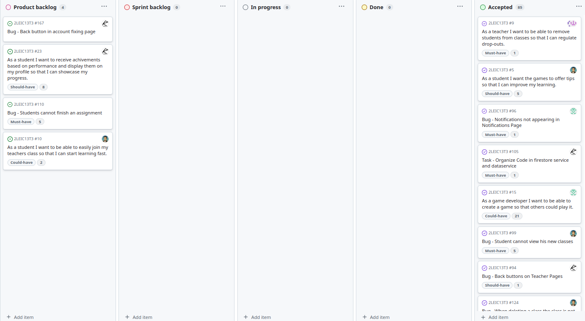

<div align="center">
🌍 <a href="README.md">English</a> | 🇵🇹 <a href="README.pt.md">Português</a>
</div>

<h3 align="center">Licenciatura em Engenharia Informática e Computação<br> L.EIC017 - Engenharia de Software<br> 2024/2025 </h3>

---
<h3 align="center"> Colaboradores &#129309 </h2>

<div align="center">

| Nome               | Número      |
|--------------------|-------------|
| Henrique Vilarinho | up202307037 |
| Leonor Bidarra     | up202307719 |
| Maria Sousa        | up202303834 |
| Miguel Roque       | up202304950 |
| Tomás Morais       | up202304692 |

Nota : 19,9

</div>

# Relatório de Desenvolvimento do LearnVironment

Bem-vindo às páginas de documentação do LearnVironment!

Este Relatório de Desenvolvimento de Software, direcionado para LEIC-ES-2024-25, fornece detalhes abrangentes sobre o LearnVironment, desde a visão de alto nível até decisões de implementação de baixo nível. Está organizado pelas seguintes atividades:

* [Modelação do Negócio](#modelação-do-negócio)  
  * [Visão do Produto](#visão-do-produto)  
  * [Funcionalidades e Suposições](#funcionalidades-e-suposições)  
  * [Elevator Pitch](#elevator-pitch)  
* [Requisitos](#requisitos)  
  * [Histórias de Utilizador](#histórias-de-utilizador)  
  * [Modelo de Domínio](#modelo-de-domínio)  
* [Arquitetura e Design](#arquitetura-e-design)  
  * [Arquitetura Lógica](#arquitetura-lógica)  
  * [Arquitetura Física](#arquitetura-física)  
  * [Protótipo Vertical](#protótipo-vertical)  
* [Gestão de Projeto](#gestão-de-projeto)  
  * [Sprint 0](#sprint-0)  
  * [Sprint 1](#sprint-1)  
  * [Sprint 2](#sprint-2)  
  * [Sprint 3](#sprint-3)  
  * [Versão Final](#versão-final)  

As contribuições são esperadas exclusivamente da equipa inicial, mas poderão ser abertas à comunidade após o curso, em todas as áreas e tópicos: requisitos, tecnologias, desenvolvimento, experimentação, testes, etc.

Por favor, entre em contacto!

Obrigado!

* Henrique Vilarinho [up202307037@up.pt](mailto:up202307037@up.pt)  
* Leonor Bidarra [up202307719@up.pt](mailto:up202307719@up.pt)  
* Maria Sousa [up202303834@up.pt](mailto:up202303834@up.pt)  
* Miguel Roque [up202304950@up.pt](mailto:up202304950@up.pt)  
* Tomás Morais [up202304692@up.pt](mailto:up202304692@up.pt)  

---
## Modelação do Negócio

A modelação do negócio no desenvolvimento de software envolve definir a visão do produto, compreender as necessidades do mercado, alinhar funcionalidades com as expectativas dos utilizadores e estabelecer as bases para o planeamento estratégico e execução.

### Visão do Produto

E se existisse uma app que gamificasse o ensino e aprendizagem sobre reciclagem e sustentabilidade?  
A nossa app LearnVironment oferece um ambiente de aprendizagem de forma divertida e lúdica.

### Funcionalidades e Suposições

#### Funcionalidades de Alto Nível:
- **Perfis de Estudante & Acompanhamento de Progresso** - Os estudantes podem criar e personalizar os seus perfis, ver o seu progresso, incluindo jogos jogados, erros cometidos e resultados de aprendizagem.  
- **Gestão de Turmas** - Os professores podem criar e gerir múltiplas turmas, atribuir estudantes a turmas específicas, escolher os jogos disponíveis e monitorizar o desempenho individual e da turma.
- **Exploração de Jogos** - Qualquer utilizador pode explorar e jogar uma variedade de jogos educativos, categorizados por idade e nível educativo. Permite que professores e desenvolvedores testem os jogos antes dos estudantes e que os estudantes joguem de forma autónoma.
- **Revisão e Verificação de Conteúdos** - Professores podem verificar os objetivos educativos e bibliografias associadas a cada jogo para garantir precisão e credibilidade. Jogos podem ter um selo de verificado.
- **Plataforma de Desenvolvimento de Jogos** - Desenvolvedores podem criar, editar e atualizar jogos educativos na app, fornecendo grupo etário recomendado, descrição e bibliografia correspondente.
- **Feedback em Tempo Real** - Jogos fornecem feedback instantâneo, destacando erros, recompensando progresso e oferecendo dicas.
- **Classificação** - Professores podem ativar uma leaderboard para cada turma, incentivando estudantes.
- **Sistema de Conquistas** - Estudantes recebem conquistas com base no desempenho, visíveis no perfil.
- **Notificações** - A app envia lembretes sobre prazos de jogos.

#### Suposições e Dependências:
- **Papéis de Utilizador** - A app terá três papéis: Estudante, Professor e Desenvolvedor, com diferentes capacidades.
- **Firebase** - A app depende dos serviços Firebase.

### Elevator Pitch

Já imaginou como envolver estudantes na aprendizagem sobre sustentabilidade de forma divertida e interativa?  
A nossa app oferece uma plataforma única para professores ajudarem estudantes entre os 6-16 anos a aprender reciclagem, cidadania e sustentabilidade através de jogos envolventes. Professores podem criar turmas, atribuir jogos personalizados e acompanhar o progresso dos alunos com estatísticas detalhadas. Ao contrário dos métodos tradicionais, a nossa app oferece uma experiência dinâmica, com jogos apropriados para cada idade, conteúdo verificado e bibliografia associada a cada jogo. Comece a tornar o ensino da sustentabilidade mais divertido e impactante hoje com a nossa app!

## Requisitos

### Histórias de Utilizador

#### História de Utilizador Mais Importante
- Como estudante, quero poder jogar qualquer jogo e aprender, mesmo que não tenha sido atribuído pelo meu professor.  
  **Valor:** Essencial  
  **Esforço:** 8  

```gherkin
Cenário: Jogar qualquer jogo disponível na app
	Dado que sou um estudante autenticado
	Quando navego para a secção de jogos
	Então devo poder selecionar e jogar qualquer jogo independentemente de ter sido atribuído
```

#### Descrição
Nossa app oferece uma plataforma de jogos educativos interativos e envolventes, focada em reciclagem, sustentabilidade e cidadania, destinada a estudantes.  

Os utilizadores podem entrar com um dos três papéis: **Estudante**, **Professor** ou **Desenvolvedor de Jogos**, cada um com suas próprias funcionalidades e benefícios.  

- **Estudantes** podem ingressar numa turma criada pelo professor ou explorar uma variedade de jogos educativos disponíveis na app. Eles podem acompanhar seu progresso, visualizando estatísticas individuais, incluindo o que aprenderam, os jogos que jogaram e o seu desempenho (erros cometidos, etc.). A app oferece uma experiência de aprendizagem personalizada, garantindo que cada estudante veja sua evolução ao longo do tempo.  

- **Professores** podem criar e gerir múltiplas turmas, adicionar alunos e atribuir jogos específicos para cada um. Podem monitorizar o progresso dos estudantes, incluindo estatísticas individuais e desempenho geral da turma. Professores podem verificar quais jogos foram jogados e a participação dos alunos, além de revisar o conteúdo dos jogos, incluindo objetivos educativos e bibliografia verificada, garantindo a precisão e credibilidade da informação.  

- **Desenvolvedores de Jogos** podem criar novos jogos educativos diretamente na app. Têm acesso aos jogos que criaram, podendo editá-los e melhorá-los quando necessário. A app oferece uma plataforma para inovação e contribuição de conteúdos, enriquecendo a experiência de aprendizagem para estudantes e professores.

Além disso, a app inclui **jogos educativos pré-construídos** sobre sustentabilidade, reciclagem e cidadania. Cada jogo apresenta descrição detalhada dos objetivos educativos, garantindo precisão e credibilidade do conteúdo. Os jogos são classificados por faixa etária, adequando-se a estudantes de diferentes idades e níveis de ensino.

---

### Modelo de Domínio

- **User** - Generalização dos três diferentes papéis que um utilizador pode assumir. Armazena informações do utilizador.

- **Student, Teacher e Game Developer** - Um utilizador pode assumir a qualquer momento um destes três papéis (generalização sobreposta e completa), limitado às ações associadas ao seu papel atual.

- **Class** - Armazena informações sobre uma turma. Um estudante pode participar em várias turmas, cada uma gerida por um professor, que pode gerir múltiplas turmas.

- **Leaderboard** - Representa o ranking dos estudantes de uma turma baseado no desempenho.

- **Achievement** - Após cumprir certas condições, o utilizador recebe uma conquista. Existem várias conquistas possíveis.

- **Game** - Armazena informações sobre um jogo. Um jogo é criado por um desenvolvedor, que também pode atualizá-lo. Jogos podem ser atribuídos por professores a estudantes de uma turma, mas todos os jogos publicados estão disponíveis para qualquer utilizador jogar.

- **Template** - Cada jogo possui um template de base, que o desenvolvedor personaliza para criar o seu jogo.

- **Bibliography** - Cada jogo possui uma bibliografia com informações relacionadas à solução do jogo. Uma mesma bibliografia pode ser usada em vários jogos.

- **Deadline** - Quando um professor atribui um jogo a uma turma, define um prazo para os estudantes o completarem.

- **Age Group e Education Level** - Cada turma e jogo possui faixa etária e nível de ensino associado, ajudando professores a selecionar jogos adequados e estudantes a praticarem conteúdos apropriados.

- **Feedback** - Após completar um jogo, o estudante vê a pontuação, os erros cometidos e dicas para melhorar.


---

### Arquitetura e Design

#### Arquitetura Lógica
A arquitetura lógica da app segue uma estrutura **em duas camadas**:  
- **Interface do Utilizador (UI)**: Responsável pelas ações e elementos visuais com que o utilizador interage.  
- **Lógica de Negócio**: Gerencia as funcionalidades da app e comunica com os serviços Firebase, permitindo armazenamento e recuperação de dados, autenticação e envio de mensagens.


#### Arquitetura Física
A arquitetura física envolve:  
- **Dispositivo do Utilizador**: Interface para interação com a app Flutter.  
- **Backend Cloud-Based (Firebase)**: Contém os serviços essenciais, como Firebase Authentication, Cloud Messaging e Firestore, além de base de dados para armazenamento e recuperação de informações.


#### Protótipo Vertical

**Sign-up e Sign-in**  
A app usa Firebase Authentication para registo e login, incluindo verificação de email.


**Editar Perfil**  
Usuários podem editar foto de perfil, nome e email, mantendo a personalização atualizada.


**Gestão de Sessão**  
A app mantém a sessão ativa, evitando que o usuário precise logar sempre que abrir a app.

**Eliminar Conta e Logout**  
Usuários podem encerrar sessão ou apagar conta, removendo dados do Firebase.


**Navegação e Interface**  
Botões básicos permitem navegar entre Estatísticas, Home e Jogos.


**Testes Unitários**  
Garantem o funcionamento correto das funções e elementos de UI, mantendo a app estável.


## Gestão de Projeto

### Sprint 0

**Objetivo:** Criar uma app Flutter simples para familiarização da equipe com o desenvolvimento; criar o Scrumboard como Github Project; completar a documentação com Lista de Funcionalidades, Diagramas UML, User Stories, Testes de Aceitação e Mockups de UI; criar protótipo vertical da app, incluindo uma funcionalidade e integrando serviços Firebase.

**Retrospectiva da Sprint**

**O que correu bem:**

- **Comunicação Eficaz:** Feedback contínuo sobre progresso das tarefas e respostas rápidas a dúvidas técnicas.  
- **Distribuição de Trabalho Equilibrada:** Divisão de tarefas permitiu foco e colaboração eficiente.  
- **Realização de Reuniões:** Reuniões mantiveram todos alinhados com metas e progresso.  
- **Definição Clara da App:** Características e funcionalidades principais documentadas com sucesso.

**O que fazer diferente:**

- **Mais Reuniões Periódicas:** Garantir reuniões regulares para acompanhar o progresso da Sprint 1.

**Desafios:**  

- Instalação correta do Flutter e Android Studio.  
- Implementação dos serviços Firebase na app.

**Quadro no Início da Sprint 0**  


**Quadro no Final da Sprint 0**  


---

### Sprint 1

**Objetivo:** Criar interface para navegar pelos jogos; desenvolver dois jogos (quiz e classificação de lixo); integrar jogos com Firebase; implementar sistema de visualização de erros; permitir registro de usuários e navegação conforme papel.

**Retrospectiva da Sprint**

**O que correu bem:**

- **Briefings Regulares e Suporte de Equipe:** Atualizações constantes e resolução rápida de dúvidas.  
- **Distribuição de Trabalho Equilibrada:** Tarefas alocadas conforme complexidade, sem sobrecarga.  
- **Mais Reuniões:** Ambiente colaborativo, tarefas concluídas mais rapidamente.

**O que fazer diferente:**

- **Revisar Trabalhos de Colegas Mais Cedo:** Detectar problemas antecipadamente para resolvê-los com calma.

**Desafios:**

- Implementação de testes unitários e de widget, mockando Firebase.

**Quadro no Início da Sprint 1**  


**Quadro no Final da Sprint 1**  


---

### Sprint 2

**Objetivo:** Criar gestão de turmas para professores; adicionar alunos e criar atribuições; permitir registro e edição de perfil; corrigir bugs (botões, página de resultados, acessibilidade); implementar notificações para estudantes.

**Retrospectiva da Sprint**

**O que correu bem:**

- **Disponibilidade e Suporte da Equipe:** Facilitação do progresso das funcionalidades.  
- **Implementação de Funcionalidades Complexas:** Maioria das funcionalidades complexas implementadas com sucesso.

**O que fazer diferente:**

- **Fazer Mais Tarefas Mais Cedo:** Evitar atrasos devido a fatores externos.

**Desafios:**

- Implementação de notificações via Firebase Cloud Messaging.  
- Falta de energia no dia anterior ao prazo.

**Happiness Meter:**  
- Tomás Morais: 😀  
- Henrique Vilarinho: 😀  
- Maria Sousa: 🙂  
- Miguel Roque: 🙂  
- Leonor Bidarra: 😀  

**Quadro no Início da Sprint 2**  


**Quadro no Final da Sprint 2**  


---

### Sprint 3

**Objetivo:** Criar interface para desenvolvedores construírem, testarem, editarem e publicarem jogos; permitir que estudantes e professores vejam estatísticas; corrigir bugs; melhorar funcionalidades e visuais.

**Retrospectiva da Sprint**

**O que correu bem:**

- **Finalização das Funcionalidades Principais:** Todas implementadas, testadas e sem bugs.  
- **Início Antecipado das Tarefas:** Melhor qualidade e tempo suficiente para melhorias.

**O que fazer diferente:**

- **Nada Significativo:** Sprint final ocorreu sem atrasos ou problemas relevantes.

**Desafios:**

- **Equilibrar Todas as Tarefas:** Volume de trabalho elevado devido a projetos, exames e prazos, mas concluído com sucesso.

**Quadro no Início da Sprint 3**  


**Quadro no Final da Sprint 3**  


---

### Versão Final

#### Turmas e Atribuições
Professores podem criar turmas, adicionar alunos, criar e distribuir atribuições. Estudantes recebem notificações de novas tarefas, garantindo acompanhamento completo.


#### Estatísticas
- **Estudantes:** Dashboard pessoal para acompanhar jogos, progresso e áreas a melhorar.  


- **Professores:** Estatísticas detalhadas da turma, incluindo tendências de desempenho e participação.


#### Desenvolvimento de Jogos
Desenvolvedores podem criar jogos interativos (quiz, drag), testar, editar e publicar publicamente ou manter privados.


#### Perfil
Usuários podem alternar entre papéis (estudante, professor, desenvolvedor), acessando ferramentas específicas de cada função.


#### Navegação por Jogos
Todos podem pesquisar jogos por palavra-chave ou explorar categorias, facilitando descoberta de conteúdos relevantes.


#### Jogar Jogos
Jogos oferecem feedback imediato via áudio e imagens, mostrando erros e dicas. Cada jogo inclui bibliografia para verificação de conteúdo pelos professores.


